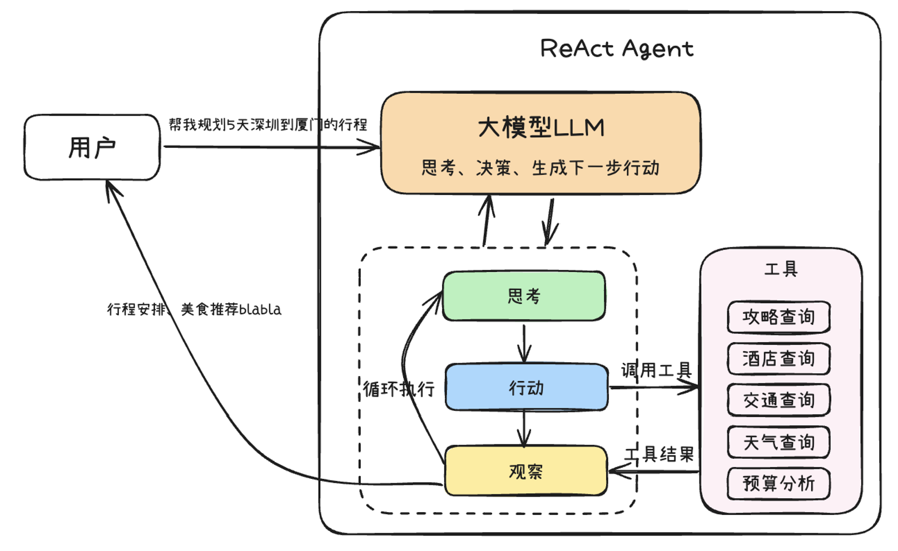

## WAMR LLM Subagent Overview


## How to Use Agents for Effective Coding

### Expectations for Large Language Models
Most current LLMs serve as assistant roles, helping improve efficiency rather than completely replacing human work.

### LLM Workflow

Reference link: https://it-1cicd-devops.gar.corp.intel.com/app/9d52aee1-7db8-4339-9678-7b648f787af5/workflow

### The Essence of Agents
* The core concept is to tell the LLM: "Here is your task, here are the tools you can use, along with supplementary context. Think about it and then decide which tools to call.  
* The core operating mechanism enables an iterative cycle of Thought → Action → Observation.



### Available Agent Tools
- READ/WRITE/GREP/PATTERN/BASH/LIST, etc.

## Best Known Methods (BKMs)
### 1. Structured Organization
Use Markdown headings (#, ##) and lists (-, *) to organize memory files:

**Easy to Read and Write**: Markdown is simple and clear, making it easy for both humans and machines to understand.  
**Structured**: It helps organize text with headers, lists, and links, which improves comprehension.  
**Commonly Used**: Many platforms use Markdown, so LLMs encounter it often and are familiar with it.  
**Web-Friendly**: Markdown can be easily converted to HTML, making it useful for web content.  
**Minimalistic**: It has less clutter, allowing LLMs to focus on the main content.  
**Supports Code**: It can include code snippets, which is helpful for technical content.  

### 2. Provide Examples to Help LLM Understand
LLMs are more sensitive to formatted data and code.

**Documentation Example:**

```cpp
/**
 * @test BasicAddition_ReturnsCorrectSum
 * @brief Validates i32.add produces correct arithmetic results for typical inputs
 * @details Tests fundamental addition operation with positive, negative, and mixed-sign integers.
 *          Verifies that i32.add correctly computes a + b for various input combinations.
 * @test_category Main - Basic functionality validation
 * @coverage_target core/iwasm/interpreter/wasm_interp_classic.c:i32_add_operation
 * @input_conditions Standard integer pairs: (5,3), (-10,-15), (20,-8)
 * @expected_behavior Returns mathematical sum: 8, -25, 12 respectively
 * @validation_method Direct comparison of WASM function result with expected values
 */
TEST_P(I32AddTest, BasicAddition_ReturnsCorrectSum) {
    // Load WASM module with i32.add test function
    wasm_module_t module = load_test_module("i32_add_test.wasm");
    ASSERT_NE(nullptr, module) << "Failed to load i32.add test module";

    // Execute test cases with documented validation
    ASSERT_EQ(8, call_i32_add(5, 3))      << "Addition of positive integers failed";
    ASSERT_EQ(-25, call_i32_add(-10, -15)) << "Addition of negative integers failed";
    ASSERT_EQ(12, call_i32_add(20, -8))    << "Addition of mixed-sign integers failed";
}
```
### 3. Use command to replace the repeatedly same input
When you need to repeatedly input content more than two times.

### 4. Multiple Agents Context Sharing
Multiple agents don't share context - they interact with each other through file storage.

### 5. Token Optimization
* Reduce unnecessary prompts
* Clean logs from build, cmake and other tools, keeping only key information
```bash
cmake --log-level=ERROR -S . -B build -DCOLLECT_CODE_COVERAGE=1
```

### 6. Context Compact/Clear Strategy

Observe context size through kode shell and actively trigger context compact.


Don't wait for Kode(or other agent tool) to automatically trigger when reaching window capacity, as automatic triggering may lose critical information.

**Manual compact at appropriate times (`/compact`)** 
* Although most AGENT tools automatically performs context compression, taking initiative is better. When you see context usage approaching full capacity, manually execute the `/compact` command. This allows compression to occur at a more natural breakpoint, such as after completing a functional module or finishing a test round. 
* Compressing at this time means the LLM is less likely to lose important information.
* If you wait for automatic compression, it might trigger right when you're in the middle of modifying code, which can easily cause problems.

**Clear (`/clear`)** 
* For relatively independent tasks, call `clear` simply start a new session. 
* Since you've already documented the task plan, a new session can quickly get up to speed by reading the documentation. 
* This is much wiser than struggling in a session that's about to explode.

### 7. Use Must/Critical/Mandatory Frequently
Use strong directive language to ensure compliance.

**Example: Mandatory Phase Compliance**
```
🔒 MANDATORY PHASE 5 COMPLIANCE
MUST execute commit with exact below template format, MUST NOT add any other extra content:
COMMIT MESSAGE TEMPLATE (USE EXACTLY AS SHOWN)
cmd: git commit -s -m {message}:
```

```bash
"[{OPCODE_NAME}] Comprehensive test coverage

Summary
- Opcode: {OPCODE_NAME} (Category: {CATEGORY})
- Test Cases: {TEST_COUNT} comprehensive tests generated
- Files Created(or Modified): {file1}, {file2}, ...
```

### 8. Formatted Output with Templates
Use consistent templates for status reporting:

```
MUST and just output content with below format, DO NOT output any other descriptive content or think process:
✅ OPCODE [opcode] COMPLETED
📊 Tests Generated: [test_count]
📝 Status: [status]
💾 Updated: [json_file]
📁 Modified files: [files_modified]
```

### 9. Emphasize Rules and Boundaries
What can and cannot be done can be represented in code, similar to ASSERT statements and if() conditions.

**Example 1: DO NOT use absolute paths**
```cpp
// ✅ CORRECT: Simple relative path
WASM_FILE = "wasm-apps/i32_add_test.wasm";
// ❌ FORBIDDEN: Absolute paths (never use /home/user/... paths)
WASM_FILE = "/home/user/wasm-micro-runtime/tests/unit/.../i32_add_test.wasm";
```

**Example 2: DO NOT use if blocks**

```cpp
// ❌ FORBIDDEN: Conditional blocks in test cases
underflow_module = wasm_runtime_load(underflow_buf, underflow_buf_size,
                                   error_buf, sizeof(error_buf));
if (underflow_module) {
    // Test logic here - NEVER DO THIS
}
```

```cpp
// ✅ REQUIRED: Use ASSERT statements with descriptive messages
underflow_module = wasm_runtime_load(underflow_buf, underflow_buf_size,
                                   error_buf, sizeof(error_buf));

// For successful load scenarios:
ASSERT_NE(nullptr, underflow_module)
    << "Failed to load test module: " << error_buf;

// For expected failure scenarios:
ASSERT_EQ(nullptr, underflow_module)
    << "Expected module load to fail for invalid bytecode, but got valid module";
```

### 10. Generated Content Limit
Do not generate over too much code lines per case(for example 200 lines).

### 11. Timely Commits and Version Management

Use version management with small iterative steps. When generating executable code, you should git commit to save progress, otherwise subsequent changes will become increasingly chaotic.

**The problem:**  
* Large-scale changes create a cascade of issues: fixing one bug leads to new problems, which create more problems, until the codebase becomes unmanageable. 
* Developers lose control when too many changes happen at once, making it impossible to distinguish necessary fixes from temporary LLM-generated patches. LLMs excel at code generation but lack long-term architectural awareness—generating too much code at once increases debugging complexity exponentially.

**Benefits of small iterative steps:**
- **High controllability:** Only changing small parts at a time makes problems easier to locate and roll back
- **Understandability:** You can follow LLM's thinking and understand what each step is doing
- **Quality assurance:** You can test after each step to ensure code quality
- **Learning opportunities:** By observing LLM's implementation methods, you can also learn new things

### 12. Control Flow Structure
```markdown
After verification → Evaluate results:

├─ ALL ISSUES RESOLVED?
│  └─ YES → Proceed to Phase 6 ✅
│
├─ ITERATION COUNT < 5?
│  ├─ YES → Return to Step 5.1 (next iteration) 🔄
│  └─ NO → Go to Step 5.5 (Final Resolution) ⚠️
│
└─ CRITICAL CRASHES PERSIST?
   └─ YES → Go to Step 5.6 (Task Failure) ❌
```

### 13. Define SUCCESS Criteria
```markdown
## FINAL SUCCESS VALIDATION:
Task is complete ONLY when:
- ✅ ALL 6 phases executed in exact sequence (Conditional for Phase 5 if Phase 4 Success)
- ✅ ALL sub-steps within each phase completed fully
- ✅ TODO list properly maintained throughout entire process
- ✅ ALL quality gates and success criteria met
- ✅ Commit created using EXACT template format without adding any extra content
```

### 14. Context Management Strategy
**Manual compact at appropriate times:** When you see context usage approaching full capacity, manually execute the `/compact` command. This allows compression to occur at a more natural breakpoint, such as after completing a functional module or finishing a test round. Compressing at this time means the LLM is less likely to lose important information. If you wait for automatic compression, it might trigger right when you're in the middle of modifying code, which can easily cause problems.

**Manual clear:** For relatively independent tasks, simply start a new session. Since you've already documented the task plan, a new session can quickly get up to speed by reading the documentation. This is much wiser than struggling in a session that's about to explode.

## Kode - Used In WAMR
Kode repository: https://github.com/shareAI-lab/Kode-cli

### Model Configuration
Configuration file location: `~/.kode.json`
```json
{
  "modelProfiles": [
    {
      "name": "openrouter claude-sonnet-4-20250514-v1:0-stg",
      "provider": "openrouter",
      "modelName": "claude-sonnet-4-20250514-v1:0-stg",
      "baseURL": "http://gateway.aichina.intel.com",
      "apiKey": "sk-okbxxxxxxxxxxxxxxxxx",
      "maxTokens": 16384,
      "contextLength": 200000,
      "reasoningEffort": null,
      "createdAt": 1762938327174,
      "isActive": true,
      "isGPT5": false,
      "validationStatus": "auto_repaired",
      "lastValidation": 1762938863256
    }
  ],
  "modelPointers": {
    "main": "claude-sonnet-4-20250514-v1:0-stg",
    "task": "claude-sonnet-4-20250514-v1:0-stg",
    "reasoning": "claude-sonnet-4-20250514-v1:0-stg",
    "quick": "claude-sonnet-4-20250514-v1:0-stg"
  }
}
```

### Permission Settings
- Kode runs in YOLO mode by default (equivalent to Claude Code's `--dangerously-skip-permissions` flag), bypassing all permission checks for maximum productivity
- YOLO mode is recommended only for trusted, secure environments when working on non-critical projects
- If you're working with important files or using models of questionable capability, use `kode --safe` to enable permission checks and manual approval for all operations

### Getting Started with Kode

#### 1. Initialize and Optimize AGENTS.md
Content for AGENTS.md should include sections that help an agent work effectively with your project:

**Popular choices:**
- Project overview
- Build and test commands
- Code style guidelines
- Development principles
- Testing instructions
- Security considerations
- Other project-specific rules

**🎯 Key Point:**
- Only add the most core content to AGENTS.md
- Do not add too much information - keep it focused and actionable

#### 2. Plan Mode (WASM Opcode Example)

**Use Plan Mode and Generate a TODO List**

Plan Mode allows you to have thorough discussions with LLM, develop detailed implementation plans, and then begin actual coding work.

Plan Mode has a hidden benefit: it helps organize your thoughts. Sometimes you think you have everything figured out, but when you actually need to articulate or write it down, you discover many details that weren't considered. The conversation process with LLM is actually a self-organizing process.

**Task Split**
- Split complex tasks into multiple small tasks
- Structure work in phases:
```
## Systematic Workflow Execution

### PHASE 1: Ultra-Deep Opcode Analysis

Perform comprehensive analysis of the target opcode through sequential steps:

#### Step 1.1: Semantic Analysis
- **Research opcode specification**
- **Identify primary function**: What does this opcode do?
- **Document operation purpose**: Why does this opcode exist?
- **Map to runtime behavior**: How does WAMR implement this operation?

#### Step 1.2: Type System Analysis
- **Input types identification**: What types does the opcode consume from stack?
- **Output types determination**: What types does the opcode produce on stack?
- **Type conversion rules**: Any implicit conversions or validations?
- **Polymorphism handling**: Does the opcode work with multiple types?

#### Step 1.3: Category Classification
Classify into one of these categories based on analysis:  
For example:
- **Numeric**: `i32.add`, `f64.mul`, `i64.eqz` - Arithmetic, comparison, bitwise operations
- **Memory**: `i32.load`, `memory.grow` - Load, store, memory control operations
- **Control Flow**: `br_if`, `call`, `loop` - Branching, loops, function calls
- **Variable**: `local.get`, `global.set` - Local and global variable access
- **Reference**: `ref.null`, `ref.func` - Reference type operations
- **Extension**: `v128.add`, `i32.atomic.load` - SIMD, atomic operations

### PHASE 2
...
### PHASE 3
...
### PHASE 4
...
```
- Maintain a TODO list (Critical)
For example:
```markdown
## WASM Opcode Test Generation TODO List

### Phase 1: Ultra-Deep Opcode Analysis
- [ ] 1.1 Semantic analysis of opcode functionality and purpose
- [ ] 1.2 Type system analysis (input/output types, conversions, polymorphism)
...

### Phase 2: Strategic Test Planning
- [ ] 2.1 Main routine test case design (basic functionality with typical values)
- [ ] 2.2 Cross-execution mode validation strategy planning
...
### Phase 3: Complete Code Generation
- [ ] 3.1 Directory structure creation in tests/unit/enhanced_opcode/{CATEGORY}/
- [ ] 3.2 enhanced_{opcode}_test.cc generation with GTest framework
...

### Phase 4: Build & Test Execution
- [ ] 4.1 Navigate to tests/unit/ and configure CMake build
- [ ] 4.2 Build test suite with parallel compilation
- [ ] 4.3 Execute test suite and capture detailed output
...

### Phase 5: Issue Detection & Resolution (Conditional - Only if Phase 4 fails)
- [ ] 5.1 Comprehensive issue detection and analysis
- [ ] 5.2 Root cause categorization (compilation, runtime, test logic, crashes)
...

### Phase 6: Code Review & Standardized Commit
- [ ] 6.1 Comprehensive code quality review
- [ ] 6.2 Files staging and standardized commit message creation
...
```

#### 3. Design Commands or Subagents to Improve Efficiency

**When to use commands:** When you need to repeatedly input content more than three times. For example, "Please help me calculate 1+1=?", then later "2+2", "3+3", etc. In such cases, consider encapsulating this input operation into a command.

**Example:** add.md
```
Input: arg1 arg2..
Output the sum of all the input args
```

**Principle:** Each tool focuses on a single responsibility, breaking down complex tasks into predictable atomic operations.

**Command Specification:**

```markdown
---
name: command-name
description: Brief description of what this command does
aliases: [alias1, alias2]
enabled: true
hidden: false
progressMessage: Custom progress message...
argNames: [arg1, arg2]
---

Command prompt content goes here.

You can reference arguments using {arg1} and {arg2} placeholders.
```
#### 4. Debug: Interactive and Refine LLM Work Behavior

#### 5. Subagents
**Why and when to use subagents:**

The benefit of subagents is that we can extend the context of tasks. Subagents have independent contexts that don't overlap with the main agent. Use subagents for subtasks while the main agent handles scheduling.

**When:** Subagents do not output the thinking process to the shell, so use commands to debug and optimize. Therefore, subagents should be the final state for complex commands after careful optimization.

```markdown
---
name: agent-name
description: "When to use this agent"
tools: ["Tool1", "Tool2", "Tool3"]  # or "*" for all tools
model_name: model-name  # optional (preferred over deprecated 'model' field)
---

System prompt content goes here...
```
For more info about commands and subagents, please refer: https://github.com/shareAI-lab/Kode-cli/tree/main/docs

**Note: Prompt --> Command --> Debug(Interactive) --> Subagent(Complex task)**  

#### 6. Context Compact/Clear Strategy
Observe context size through kode shell and actively trigger context compact during command or subagent runs.


#### 7. Execute (Batch Operations for Multiple Same Type Tasks)
Batch command → loop call subagent to do the tasks

**Example workflow:** batch-opcode-test.md (command) → opcode-test-enhance.md (subagent)


## How to Switch to Claude Code

### 1. Install Claude Code
Follow the official installation instructions.

### 2. Setup Configuration
Configuration file location: `~/.claude/settings.json`

```json
{
  "env": {
    "ANTHROPIC_AUTH_TOKEN": "sk-xxxxxxxxxxxxxxxxxxxx",
    "ANTHROPIC_BASE_URL": "http://gateway.aichina.intel.com",
    "API_TIMEOUT_MS": "3000000",
    "CLAUDE_CODE_DISABLE_NONESSENTIAL_TRAFFIC": "1",
    "ANTHROPIC_DEFAULT_HAIKU_MODEL": "claude-sonnet-4-20250514-v1:0-stg",
    "ANTHROPIC_DEFAULT_SONNET_MODEL": "claude-sonnet-4-20250514-v1:0-stg",
    "ANTHROPIC_DEFAULT_OPUS_MODEL": "claude-sonnet-4-20250514-v1:0-stg"
  },
  "alwaysThinkingEnabled": false
}
```